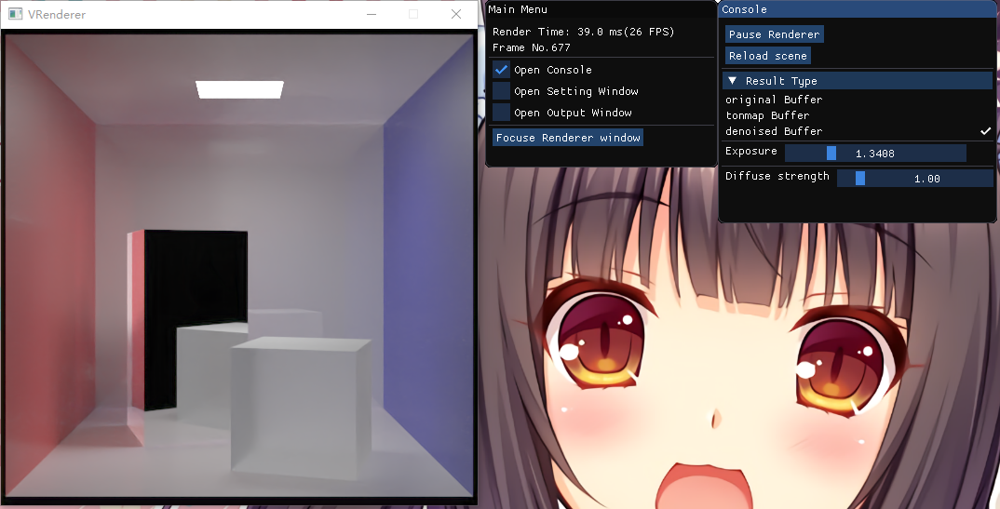

# README

## Introduction

VRenderer is a RT/PM renderer based on OptiX and CUDA, accelerated by RTX tech of NVIDIA.

## BUILD

Only support windows 10, x64.

To build it, you will need to install OptiX and CUDA first.

Make sure your GPU driver is the newest!

Git bash in Root dir, then:

`./FindOptiX.sh 'YOUR_OPTIX_INSTALL_ROOT_DIR'                 `

Open CMake, click Configure, change the generator of CMake to VS2017 Win64. After everything is done, click Generate.

Open VRenderer.sln and build the project.
